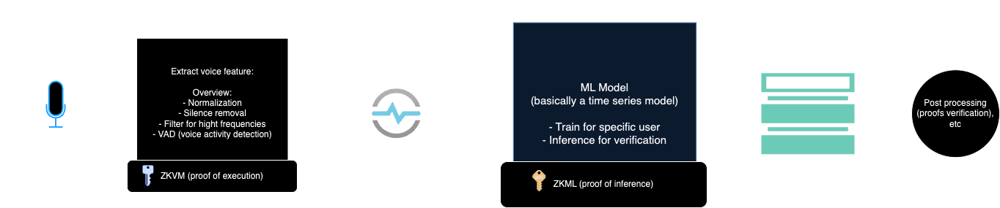
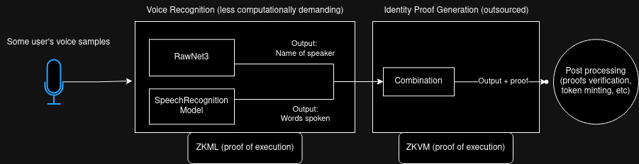

# voizk-ML

First attempt at using voice as an authentication method without relying in centralized Big Tech ML servers (i.e. doing it privately or at least verifiably).

**TL;DR: With the current ZKML tech the solution is either impossible or unfeasible. Most models fail at configuration on circuitation and ZKVMs are too limited still.**

## Introduction
In recent years, biometric authentication has become a popular method for secure access to devices and applications, voice being one of the most used for personal assistants. This approach, typically facilitated by machine learning models, provides a convenient, hands-free way to authenticate users based on unique vocal characteristics. Also, voice is one of the most secure methods of authentication according to [Fundamentals of Biometric Technology
](https://csu-sjsu.primo.exlibrisgroup.com/permalink/01CALS_SJO/1nj5q0c/cdi_walterdegruyter_books_10_1515_9781614516293_1).

However, most voice authentication systems today rely on centralized servers managed by large technology companies, which raises significant concerns about privacy and control over personal data. User voiceprints are often stored in centralized databases, leaving them vulnerable to breaches, surveillance, and unauthorized access. This setup conflicts with the growing demand for privacy-preserving technologies, particularly in sensitive applications where users prefer to keep biometric data secure and local. 

To address these challenges, zero-knowledge (ZK) technology offers a promising path forward by enabling privacy-preserving voice authentication that does not rely on centralized servers or that can be verified. Using ZK proofs, devices can verify a user's identity without revealing or storing their voice data externally, ensuring that personal information remains private and under the user's control. This approach could eliminate the need for centralized machine learning models, allowing devices to locally and securely verify users with minimal data exposure. In this research, we explore whether the ZK tech allows us to actually build a voice authentication system in a decentralized, trustless or verifiable way (on the assumption that actually useful parts are somehow made to work).

### Disclaimers

ML models that can be quickly enough trained and used for inference during authentication are not things currently in existence. In a real system, it would require a lot of design work and testing to have it working, so we originally set the goal to just try and test already available examples of voice-related tools (both ML and OG) and see if they can be run in ZK runtimes like ZKML and ZKVM frameworks in any way that would give us proof of end-to-end-verification (as long as we can process the data is some way and generate a proof we can reasonably change the actual processing to suit future needs). So the core of our research was finding the right tech and see if it can run with those frameworks.

## Methodology
### 1. Feature extraction and prediction

Our first approach was including four components plus a couple side cars:
1) Pre-processing of the raw data with feature extraction 
2) Two ML models to actually consume the pre-processed data and provide meaningful prediction
3) Post-processing with additional checks giving the final answer yes/no to the question "is the user authenticated?"

Turns out ZKVMs are still limited. We cannot process a large input there, most libraries cannot be compiled. Essentially the only thing we can run from the world of Rust is simple processing of short enough input strings plus simple computations (it can hash, it can verify proofs, it can operate on strings and numbers to some extent, but processig sound data for cleaning and extraction, even if there are libraries and algorithms, it's just hard to implement from scratch and overhead would be huge even then).

LSTM or RNN model that can consume such cleaned and condensed input can work but requires training on a large enough data set (not as good for a few-shots prediction on just a couple samples users typically provide for authentication purposes) and we cannot use pre-trained models good with few-shots prediction within ZKML frameworks like EZKL.

The first wall is hit on ZKVMs: If we cannot verify pre-processing we already cannot provide anything end-to-end verified.

### 2. Pretrained inference and proof

After our first approach failed we tried to find ML tools to process raw sound. There are networks trained on VoxCeleb dataset which could be used in our fun example, also some speech-to-text models. In our second approach we though of building a system with three main components:
1) A model for identifying the speaker (RawNet3)
2) A model for recognizing the words spoken (PENDING_MODEL)
3) The protocols for generating the proofs of computation on each of the outputs (EZKL for the ZKML framework, ZKM for a ZKVM).

We tried several of them just to see how inference works and what outputs will be there and the wall we hit was also close: EZKL and underlying tract doesn't suport tensor sequence operations and none of those models dealing with sound can be circuitized. The search for a weird workaround gave us nothing good.

Every piece of the diagram works as expected in a local execution environment, but does not work in a ZKVM or using a ZKML framework.

## Conclusion
Our main conclusion is a soft-negative: we cannot do this with the current state of ZK tech. It's not impossible in theory, just in practice right now.

The unfortunate answer is the tech is not ready to manage complex things and we should change the idea to something so simple it doesn't have to process any raw data and only deals with nice discrete series and ideally avoid computationally or otherwise complex operations. I thought about just showing a two-liner in rust concatenating two strings and explaining that it's about the limit of what the tech can run and finish proof generation this week but I don't try to be critical. We just need to develop better core tech here.

